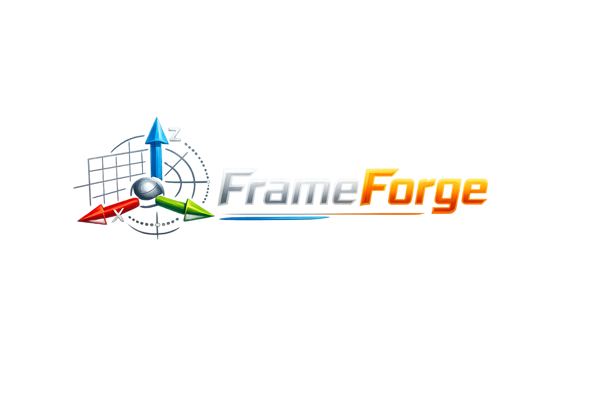

<p align="center">
  
</p>

# FrameForge

A linter and diagnostician for robot frame trees, sensor conventions, and
transform consistency. It does **not** draw the TF tree (Foxglove and
`tf2_tools` already do that) — it answers *why the tree doesn't make physical or
mathematical sense, and which transform is most likely wrong.*

FrameForge is a single static Zig binary with **zero runtime dependencies** — no
ROS install required. It ingests TF dumps, CSV sensor logs, and a declarative
robot profile, and emits ranked, evidence-backed findings.

> General tool, real first target: the included
> [`profiles/barracuda.profile.yaml`](profiles/barracuda.profile.yaml) was
> verified against the [Barracuda AUV](https://github.com/usc-robosub/barracuda_ws)'s URDF, a captured TF dump, the estimator
> config, and git history. See the comments in that file for provenance.

## Why bother?

Frame bugs are the worst kind of bug: they don't crash anything. A swapped axis,
an upside-down IMU, a missing `odom → base_link`, a controller subscribed to the
wrong topic — none of these throw an error. The robot just localizes quietly
wrong, drifts, or fights itself, and you lose an afternoon bisecting transforms by
hand: suspect the IMU, change a static transform, watch it not help, repeat. The
tools that exist *draw* the tree beautifully but still leave you to infer the
fault yourself. FrameForge exists to close that gap — to turn "something in the
frames is off" into a named cause with the evidence and the fix, in one command,
before the robot ever gets wet. If it saves one multi-hour debugging loop, it has
paid for itself.

## Build & run

Requires **Zig 0.16.0**.

```bash
zig build                 # produces zig-out/bin/frameforge
zig build test            # unit tests
zig build run -- help     # run via the build system
```

FrameForge is written in Zig so it can ship as a small native diagnostic binary
that runs directly on Jetson, laptops, or CI **without a ROS runtime, garbage
collector, or Python environment.**

### Cross-compilation

Cross-compilation is first-class in Zig — `build.zig` already exposes `-Dtarget`
and `-Doptimize`, so one command builds a single static binary for any of the
machines you actually run on, from any host (these were all built from an Apple
Silicon Mac):

```bash
# Jetson AGX Orin / Raspberry Pi (64-bit)
zig build -Dtarget=aarch64-linux-musl -Doptimize=ReleaseSmall
# Linux workstation / CI runner
zig build -Dtarget=x86_64-linux-musl  -Doptimize=ReleaseSmall
# Raspberry Pi (32-bit)
zig build -Dtarget=arm-linux-musleabihf -Doptimize=ReleaseSmall
```

| Target machine            | `-Dtarget`               | Result                          |
|---------------------------|--------------------------|---------------------------------|
| Mac laptop (Apple Silicon)| *(native)*               | native binary                   |
| Linux workstation / CI    | `x86_64-linux-musl`      | ~240K static ELF, no libc dep   |
| Jetson AGX Orin / Pi 64-bit | `aarch64-linux-musl`   | ~230K static ELF, no libc dep   |

Each is a statically-linked, dependency-free executable — copy it to the target
and run it; no install, no runtime.

## Commands

```text
frameforge tf       <tree.gv>          Validate TF structure + profile agreement
frameforge path     <tree.gv> <src> <dst>   Explain why two frames are (not) linked
                                       (alias: why-not-linked)
frameforge gravity  <imu.csv>          Check gravity direction/magnitude (stationary IMU)
frameforge compare  <a.csv> <b.csv>    Median roll/pitch/yaw diff; names 90/180 deg bugs
frameforge validate --profile <f> [--tf F] [--imu F]   Run all available checks
frameforge profile  <file>             Load a profile and print a summary
```

Exit code is non-zero when any `FAIL` is emitted (suitable for CI).

### Try it on the bundled Barracuda data

```bash
zig build
P=profiles/barracuda.profile.yaml

# Real captured TF dump — reproduces the "base_link missing from the tree" finding
./zig-out/bin/frameforge tf examples/barracuda_tf.gv --profile $P

# Why two frames aren't linked: disconnected components + the missing transform
./zig-out/bin/frameforge path examples/barracuda_tf_disconnected.gv odom barracuda/base_link --profile $P
# ...and a connected lookup on the real tree
./zig-out/bin/frameforge path examples/barracuda_tf.gv map barracuda_left_camera_optical_frame

# Gravity from a stationary IMU log (good vs upside-down)
./zig-out/bin/frameforge gravity examples/imu_stationary_good.csv    --profile $P
./zig-out/bin/frameforge gravity examples/imu_stationary_flipped.csv --profile $P

# Two orientation streams that disagree by 180 deg in yaw
./zig-out/bin/frameforge compare examples/orientation_imu.csv examples/orientation_camera.csv
```

## The robot profile

Checks are not hard-coded to any robot. A robot declares its expected setup once
— world/base frames, conventions, gravity, sensor topic→frame map, expected
rates, the estimator contract, and which downstream nodes must consume the
estimator. Every check then validates measured data against that contract. Adding
a robot is "write a profile," not a code change.

## Architecture

```text
parsers (tfdump .gv · CSV)              src/parsers/
        |  normalize into
        v
frame model + ROBOT PROFILE             src/profile.zig
        |  each check = measured-vs-profile pass
        v
checks  ->  findings  ->  reporter      src/checks/, src/finding.zig
```

Each check is an independent pass that emits `Finding`s (id, severity, summary,
and ranked `Cause`s with how-to-confirm / how-to-fix). Adding a check never
touches a parser; adding a parser never touches a check.

## Why Zig?

FrameForge is designed to be a small, fast, and dependable command-line tool that
engineers can run directly on robots, Jetson devices, laptops, or CI systems
without requiring a large runtime or ROS installation. Zig is a natural fit for
that goal.

Zig produces lightweight native executables with no garbage collector or virtual
machine, making it well suited for robotics infrastructure tools that need
predictable performance and low resource usage. It also provides direct control
over memory, strong compile-time safety, excellent cross-compilation support, and
efficient binary parsing — useful for processing TF dumps, robot logs, and
exported sensor data.

Unlike visualization tools such as Foxglove, FrameForge focuses on diagnosis
rather than display. It analyzes transform graphs, frame conventions, and sensor
relationships to explain why a TF tree is inconsistent or why two frames do not
agree. Zig's systems-programming strengths make it well suited for implementing
graph traversal, transform validation, and high-performance analysis while
remaining easy to deploy as a single portable executable.

## Status (M1)

Implemented: profile loader, `.gv` TF-dump and CSV parsers, and the structure,
gravity, and cross-sensor convention checks — validated end-to-end on real
Barracuda artifacts.

Planned: rosbag2 `.db3`/`.mcap` + CDR ingest, static-TF-vs-URDF diff,
timestamp/rate analysis, consumer-contract scanning of launch/param files, JSON
output, and the GTSAM estimator contract checks.

## Inspiration

FrameForge grew out of debugging the **Barracuda AUV** (`https://github.com/usc-robosub/barracuda_ws`). Chasing
localization issues by hand: suspect the IMU, change a transform, watch it not
help, is the multi-hour loop this tool exists to collapse into one command. The
bundled Barracuda profile and the real failure modes it encodes come straight
from that work.
